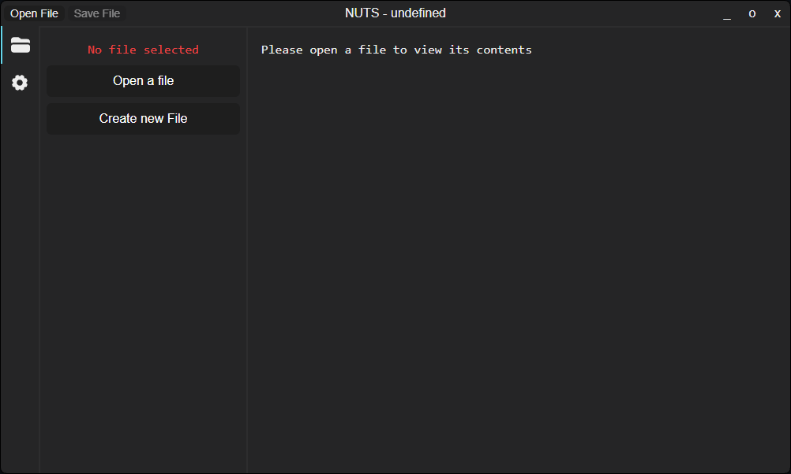
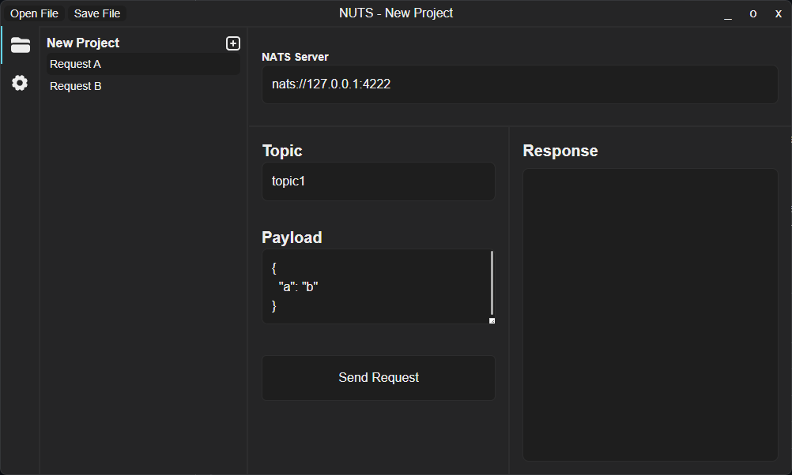
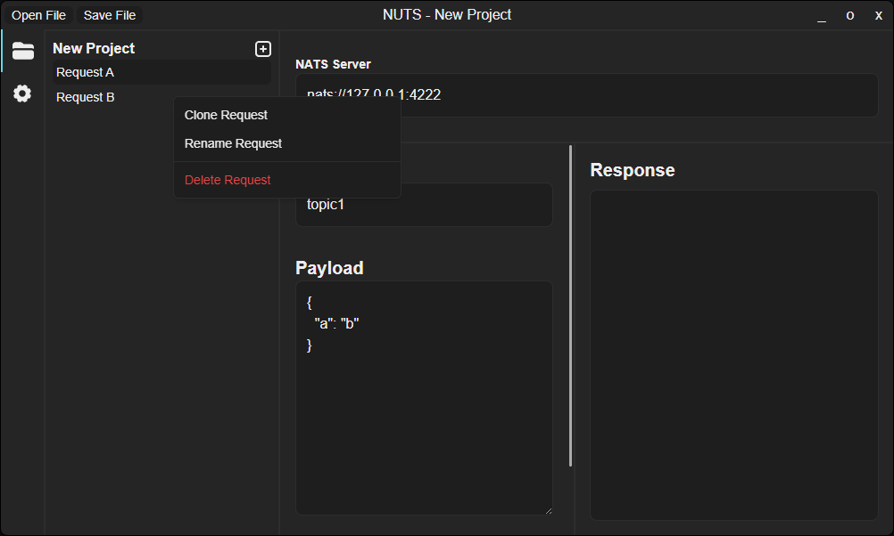
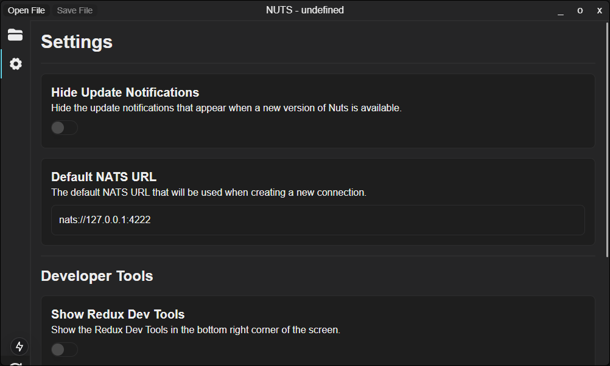

# NUTS - GUI Client

I developed this GUI client to help me develop Microservices using NATS as the messaging system. It is a simple client that allows you to connect to a NATS server and send Requests.

## Features
- Connect to a NATS server
- Send a Request
- View the Response
- View the Request and Response in JSON format
- Source Control ready JSON file
- Easy to use UI
- ...

## Installation
- Download the latest release from the [Releases](https://github.com/JNSAPH/NUTS-CLIENT/releases) for your OS
- Extract the zip file
- Run the executable

**for macOS:** Since the app is not signed, you will need to do some extra steps to run the app. Please read the Release notes for more information. Sorry for the inconvenience and I will try to fix this in the future.

## Some Screenshots

