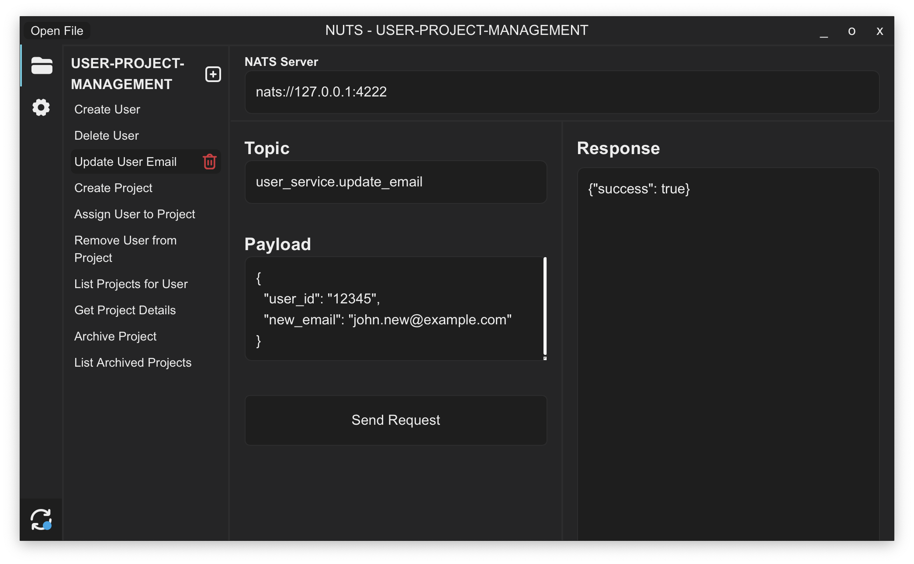

# NUTS-Client

NUTS-Client is a file-based NATS GUI designed to streamline the development of microservices. It provides a user-friendly interface to interact with NATS, a powerful messaging system commonly used in distributed systems.

<center>
    
</center>

---

## Development

### Setting Up a NATS Server

To develop and test your NATS client, you will need a running NATS Server. We provide a Python-based service that listens to topics like `time`, `TP_TEST1`, and `TP_TEST2`. 

The recommended way to run a NATS Broker is via Docker. You can do so with the following commands:

1. **Pull the NATS Docker image**:

```sh
docker pull nats
```

2. **Run the NATS Server with JetStream support**:

```sh
docker run -p 4222:4222 nats -p 4222 --jetstream
```

This will start the NATS server, listening on port `4222`.

---

### Running the Client in Development Mode

To run the NUTS-Client in development mode, use the following command:

```sh
npm run tauri dev
```

This will start the client in a development environment.

---

### Building the Client in Debug Mode

If you want to build the client for debugging purposes, run:

```sh
npm run tauri build -- --debug
```

This will generate a debug build of the client.

---

### Building the Client for Release

To create a release build of the client, use the following command:

```sh
npm run tauri build
```

This will generate a production-ready build of the NUTS-Client.
