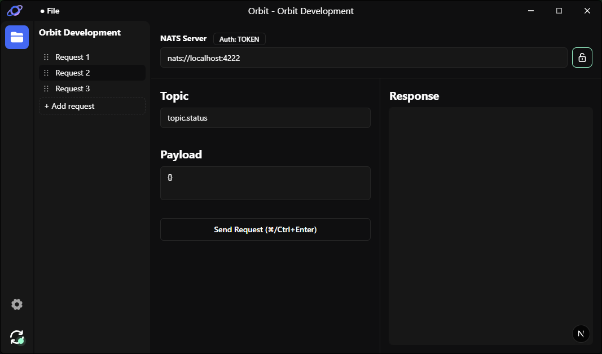

<center>
    
</center>

# 🚀 Announcement: **NUTS-Client** is now **Orbit**

**TL;DR:** We’ve renamed **NUTS-Client** to **Orbit**. Same project, same mission—clearer name, sharper UI, and a few polish touches. No breaking changes to your data; a simple rename in your tooling and you're good to go.

---

## Why the rename?

- **Clarity:** “Orbit” better reflects the idea of observing, navigating, and interacting with your services and messages from a single, stable vantage point.  
- **Room to grow:** We’re expanding beyond the original scope, and the new name fits the broader roadmap.

---

## What is Orbit?

Orbit is a **file-based GUI client for NATS** that streamlines microservice development. Use it to browse subjects, publish/subscribe, inspect payloads, and iterate quickly—without leaving your flow.


<center>
    
</center>


## Development

### Setting Up a NATS Server
To develop and test your NATS client, you will need a running NATS Server. We provide a Python-based service that listens to topics like `time`, `TP_TEST1`, and `TP_TEST2`. 

The recommended way to run a NATS Broker is via Docker. You can do so with the following commands:

1. **Pull the NATS Docker image**:

```sh
docker pull nats
```

2. **Run the NATS Server with JetStream support**:

```sh
docker run -p 4222:4222 nats -p 4222 --jetstream
```

This will start the NATS server, listening on port `4222`.

---

### Running the Client in Development Mode

To run the NUTS-Client in development mode, use the following command:

```sh
npm run tauri dev
```

This will start the client in a development environment.
